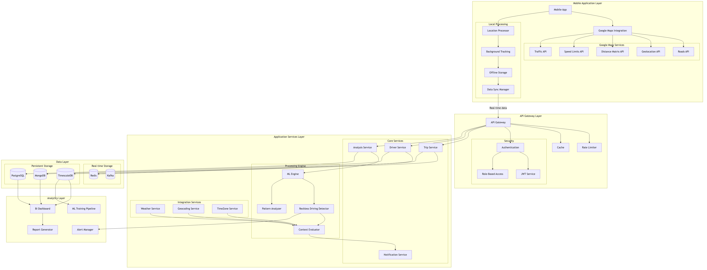

# Driver Safety App

This app will enhance road safety by proactively notifying users, admins, and supervisors about drivers who may need to improve their driving habits. By promoting safer driving practices and adherence to traffic rules, it will help reduce road risks and create a safer environment for everyone.

## Architectre Diagram


### Breakdown of Major Components

1. **Mobile Application Layer:**
   - **Mobile App:** UI for drivers, real-time tracking, trip management, notifications.
   - **Google Maps Integration:** Location tracking, speed monitoring, route optimization.
   - **Local Processing:** Background tracking, offline storage, sync management.

2. **API Gateway Layer:**
   - **Security:** JWT authentication, role-based access, API key management.
   - **Performance:** Rate limiting, request caching, load balancing.

3. **Application Services Layer:**
   - **Core Services:** Trip management, driver profiles, driving analysis, notifications.
   - **Processing Engine:** ML models, behavior analysis, contextual evaluation.

4. **Data Layer:**
   - **Real-time Storage:** Redis for caching, Kafka for event streaming.
   - **Persistent Storage:** TimescaleDB (time-series), MongoDB (driver profiles), PostgreSQL (relational data).

5. **Analytics Layer:**
   - **BI Dashboard:** Real-time monitoring.
   - **Report Generator:** Analysis reports.
   - **Alert Manager:** Notification rules.
   - **ML Training Pipeline:** Model updates.

### Key Data Flows
1. **Location Data Flow:**
   ```
   Mobile App -> Google Maps -> Local Processing -> API Gateway -> Trip Service -> TimescaleDB
   ```

2. **Incident Detection Flow:**
   ```
   Analysis Service -> ML Engine -> Pattern Analyzer -> Context Evaluator -> Alert Manager
   ```

3. **Reporting Flow:**
   ```
   Multiple DBs -> BI Dashboard -> Report Generator -> Notification Service
   ```

### API Structure
```plaintext
/api/v1/
├── auth/
│   ├── login
│   └── refresh-token
├── trips/
│   ├── start
│   ├── end
│   └── {tripId}/
│       ├── details
│       └── incidents
├── drivers/
│   ├── {driverId}/
│   │   ├── profile
│   │   ├── trips
│   │   └── violations
└── analytics/
    ├── reports
    └── dashboard-data
```


More data will be needed in the future as per analysis on web

❤️ ❤️